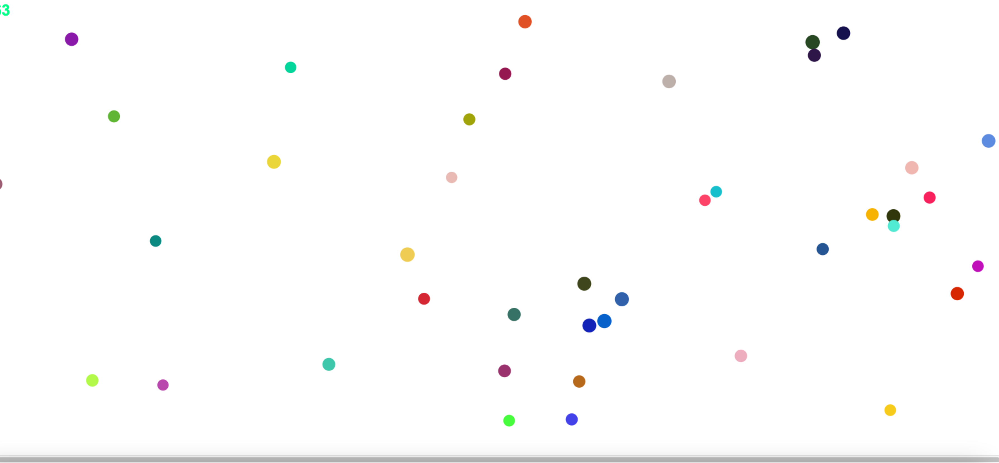

# GameFAC
# 🎯 Smash the Balls! 🟣💥

A fast-paced canvas game where your mission is simple:  
**💣 Destroy all the balls before time runs out!**  

Built with pure **HTML**, **CSS**, and **JavaScript**, this game includes animations, music, explosions, and a smooth countdown timer for extra pressure 🧠⏱️

---

## 🕹️ How to Play

1. Launch the game.
2. Choose your favorite **retro music** 🎶:
   - 🎵 Tetris
   - 🍄 Mario
   - 🦔 Sonic
3. Click the balls as fast as you can before the timer hits zero!
4. Watch the colorful explosions when you smash them 💥💫

---

## 🧩 Features

- 🎨 Dynamic canvas resizing for any screen
- 🧠 Simple click-based mechanics with a ticking clock
- 💾 Pop-up instructions using the `<dialog>` element
- 🎵 Sound effects and music themes from classic games
- 🌈 Random color particle explosions
- 🖥️ Responsive canvas and optimized rendering loop

---

## 🎧 Music & Sounds

Choose from a nostalgic selection of game tunes:
- `music/tetris.mp3`
- `music/mario.mp3`
- `music/sonic.mp3`
- Random FX: `badnik`, `collapse`, `jump`, `spring`, `tally`, `finished`

> Music and sound effects will automatically play when you click balls and finish the game. Sound can be muted anytime.

---

## 📸 Screenshot

  
> *Optional: add a real screenshot from your game and name it `screenshot.png`*

---

## 🚀 Getting Started

To play locally:

```bash
git clone https://github.com/your-username/smash-the-balls.git
cd smash-the-balls
open index.html
